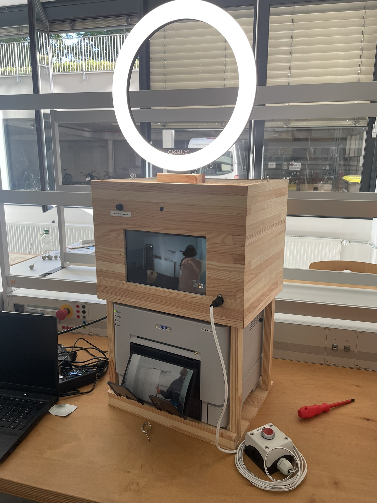
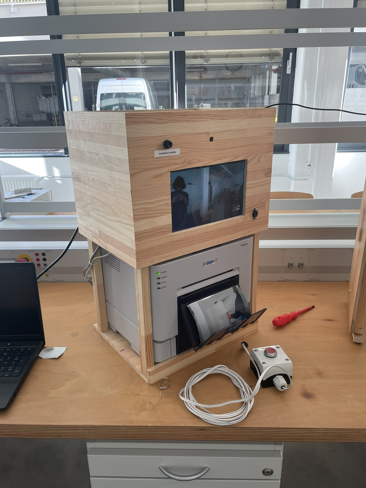
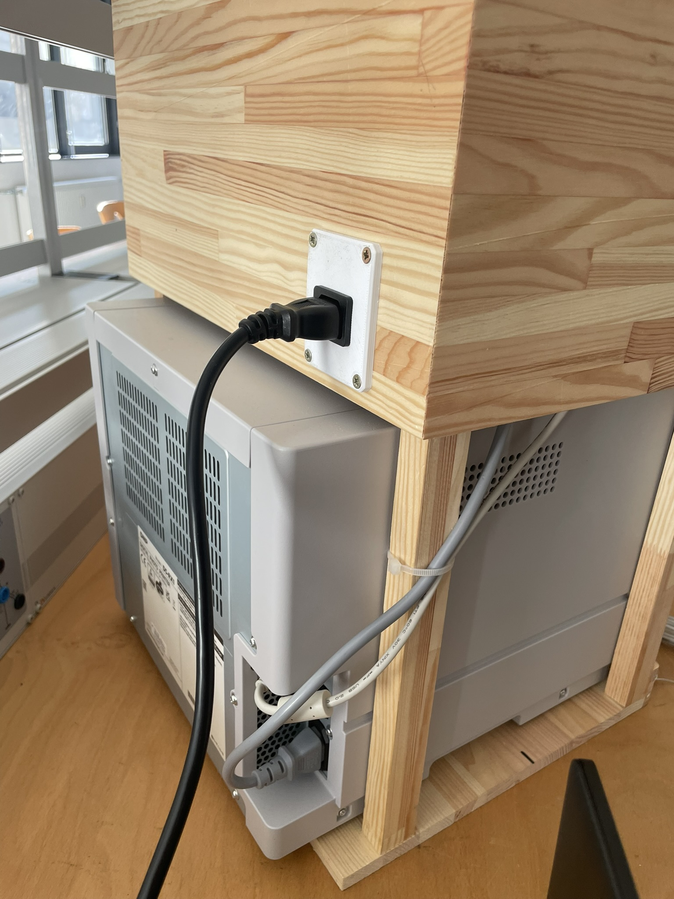
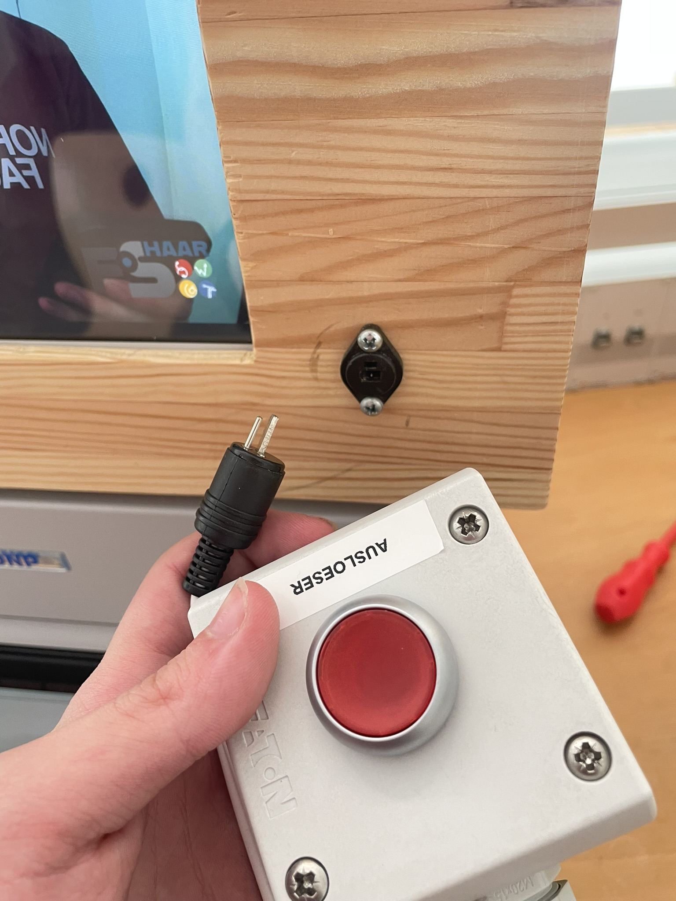
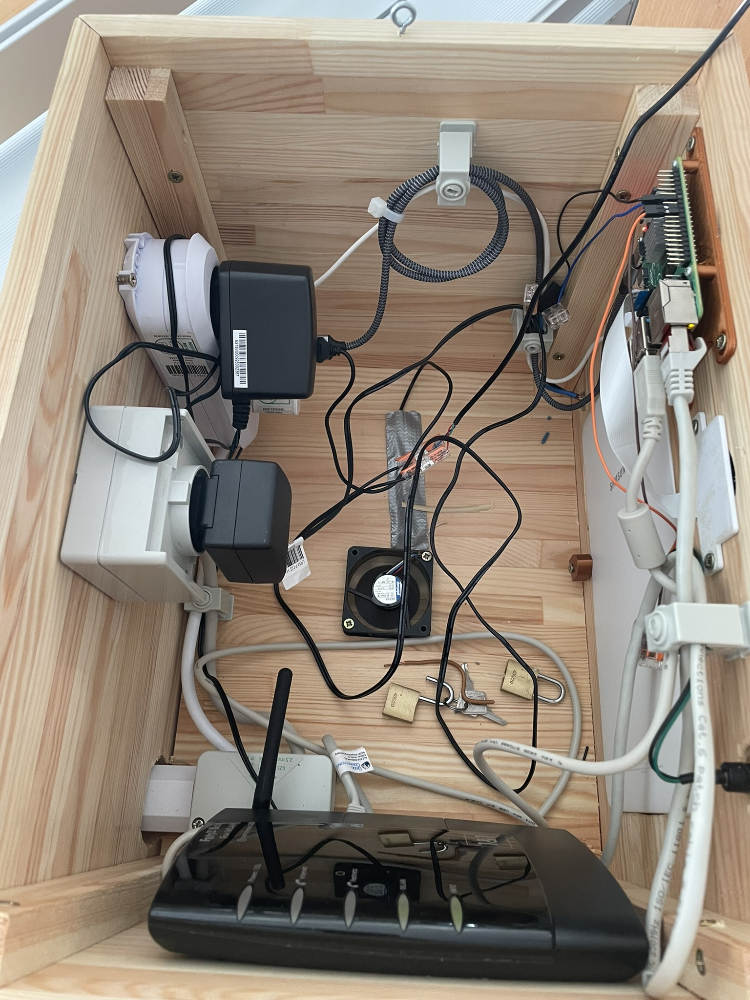

# Projekt: Die Photobooth

### Ziel dieses Projektes war im Elektro-Praktikum der FOS Haar eine funktionierende Photobox zu bauen:

Die Software ist einzig und allein das Werk von [mgineer85](https://github.com/photobooth-app/photobooth-app). Meinen größten Respekt an ihn, ohne seine photobooth-software wäre das ganze Projekt nicht möglich gewesen. Die Software läuft auf einem **Raspberry Pi 4** mit 2GB an RAM. Das Interface läuft auf einem alten **Android Tablet**, welches durch einen kleinen verbauten **Router** via WLAN mit dem Raspi verbunden ist. Die Kamera ist ein **Camera Module 3** in der Weitwinkel-Version. Der Drucker ist verglichen zu der restlichen Hardware ziemlich overkill; wir hatten einen **DNP DS-RX1HS**, einen Thermosublimationsdrucker, von der Schulleitung gesponsert bekommen (Preis: ca 850€).
Das Gehäuse ist in Zusammenarbeit mit der Holzwerkstatt im gegenüberliegenden Raum entstanden.

#### Die Dokumentation ist [hier](DokumentationPhotobox.pdf) zu finden.

## Bilder

 
 
 
